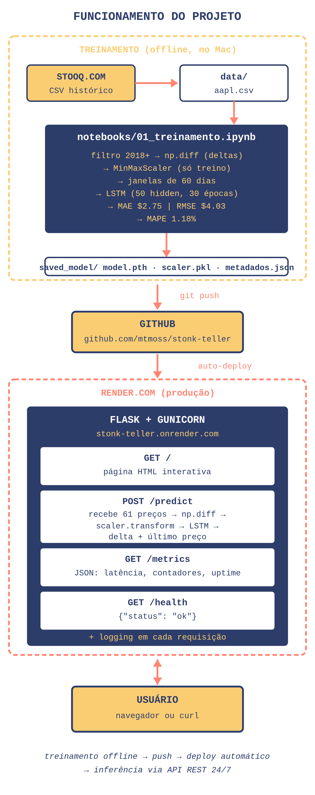

# Stonk Teller 📈🔮

Modelo LSTM para prever o preço de fechamento da AAPL.
Tech Challenge Fase 4 — FIAP MLET.

## 🌐 API em produção

**https://stonk-teller.onrender.com**

(Primeiro acesso pode demorar ~30-60s — cold start do plano gratuito do Render.)

## Métricas no conjunto de validação

- **MAE:** $2.75
- **RMSE:** $4.03
- **MAPE:** 1.18%

## Funcionamento do projeto



## Arquitetura

- **Modelo:** LSTM com 1 camada (50 unidades hidden) + camada linear de saída
- **Alvo:** variação diária do preço (delta), não o preço bruto
- **API:** Flask + Gunicorn rodando na Render.com
- **Monitoramento:** logs estruturados + endpoint `/metrics` em JSON
- **Auto-deploy:** a cada push na branch `main`, o Render rebuilda e republica

## Stack

Python 3.11, PyTorch (CPU-only), Flask, Gunicorn, scikit-learn, Render.com

## Endpoints

| Método | Rota | Descrição |
|---|---|---|
| GET | `/` | Página HTML interativa |
| POST | `/predict` | Faz a previsão (recebe 61 preços, retorna preço previsto) |
| GET | `/metrics` | Métricas em JSON (latência, contadores, uptime) |
| GET | `/health` | Verifica se a API está online |

### Exemplo de chamada `/predict`

```bash
curl -X POST https://stonk-teller.onrender.com/predict \
  -H "Content-Type: application/json" \
  -d '{"precos": [180.0, 180.5, ..., 200.1]}'

# resposta:
# {"preco_previsto": 200.28, "delta_previsto": 0.18, "latencia_segundos": 1.42}
```

## Como rodar localmente

Pré-requisitos: Python 3.11.

```bash
git clone https://github.com/mtmoss/stonk-teller.git
cd stonk-teller
python3 -m venv venv
source venv/bin/activate
pip install -r requirements.txt
gunicorn --chdir app --bind 0.0.0.0:5001 --workers 1 --timeout 300 app:app
```

API disponível em `http://localhost:5001`.

## Observações técnicas

A API espera **61 preços** (não 60) porque o modelo prevê variação diária (delta). 60 deltas vêm de 61 preços consecutivos via `np.diff`. Detalhes do raciocínio em `notebooks/01_treinamento.ipynb`.

## Coleta dos dados

Dataset baixado manualmente do [Stooq](https://stooq.com/q/d/?s=aapl.us). A biblioteca `yfinance` recomendada no enunciado estava com bugs de bloqueio do Yahoo durante o desenvolvimento (maio/2026), problema documentado em issues abertas no [GitHub do projeto](https://github.com/ranaroussi/yfinance/issues).

## Vídeo de demonstração

https://youtu.be/BTBUMieWDEg

---

Repositório: https://github.com/mtmoss/stonk-teller
